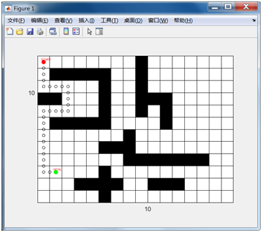
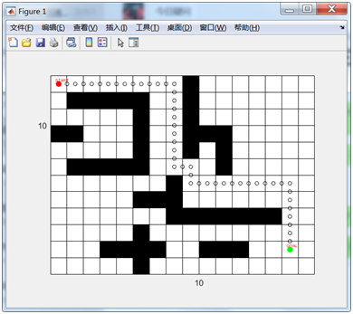
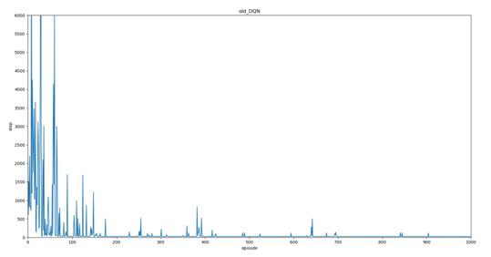
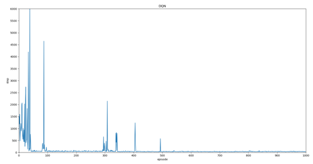
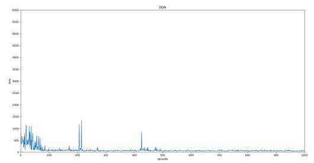

# DQN by Matlab
DQN实现避障控制
###实现环境：
Matlab 2019a及以上，因为使用了deeplearning toolbox搭建网络
###结果
小地图：  
  

稍复杂点的地图：  
  

  

#DQN by Python
使用Pytorch框架搭建神经网络

##性能对比（episode-step图）  
传统DQN算法：  

基于优先级采样的DQN算法：  

DQN + 人工势场：
